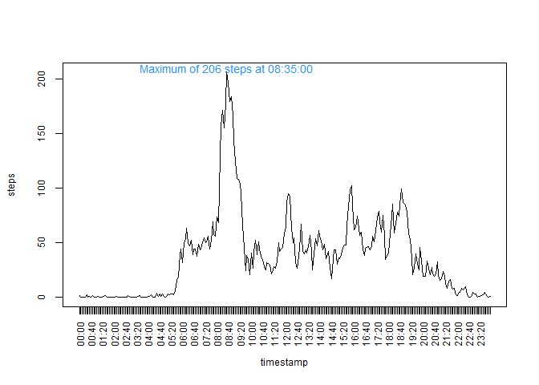
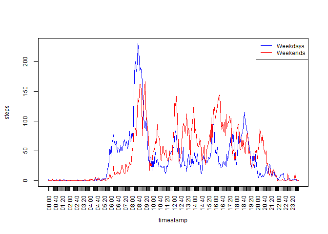

## Loading and preprocessing the data

We'll need a few libraries to display data (ggplot2), change the interval IDs into timestamps (chron) and for data manipulation (dplyr)


```r
library(ggplot2)
library(dplyr)
library(chron)

rawdata <- read.csv(unz('activity.zip', 'activity.csv'))
data <- rawdata
data$date <- as.Date(data$date)
```


## What is mean total number of steps taken per day?

We can see here the frequency of total steps per day. We can see that values between 10000 and 12000 steps per day are the most common. *(We've removed the 0 values corresponding to missing data)*


```r
totalsteps <- aggregate(data$steps, by=list(data$date), sum, na.rm=TRUE)
names(totalsteps) <- c("date", "steps")
# Remove the 0 values from the set
totalsteps <- subset(totalsteps, steps != 0)

ggplot(totalsteps, aes(steps)) +
  geom_histogram()
```

```
## `stat_bin()` using `bins = 30`. Pick better value with `binwidth`.
```

<!-- -->

The mean and median are indeed in that range.


```r
info <- c(mean(totalsteps$steps, na.rm=TRUE),
          median(totalsteps$steps, na.rm=TRUE))
names(info) <- c("mean", "median")

info
```

```
##     mean   median 
## 10766.19 10765.00
```


## What is the average daily activity pattern?


```r
# each day have 288 intervals of 5 min each
# we'll label those accordingly per day
# get all 5-min intervals in a day
# 0,00 | 0,05 | ... 23,55
day_intervals <- merge(0:23, seq(0, 55, by = 5)) %>%
                 arrange(x) 

# and merge as time intervals
# 00:00:00 ... 23:55:00
day_intervals <- chron(time = paste(day_intervals$x, ':', day_intervals$y, ':', 0))

# we add the timestamp column to our table based on day_intervals
data <- mutate(data, timestamp = rep(day_intervals,61))

means_by_timestamp <- data %>%
                      group_by(timestamp) %>%
                      summarise(steps = mean(steps, na.rm = TRUE))
```

```
## `summarise()` ungrouping output (override with `.groups` argument)
```

```r
names(means_by_timestamp) <- c("timestamp", "steps")

plot(means_by_timestamp, type = "l",
     xaxt = "n",
     cex.axis = 0.75, cex.lab = 0.75)
axis(1, labels = substr(day_intervals, 1, 5),
     at = day_intervals,
     las = 2,
     cex.axis = 0.75)

# the time at which the steps are max on average
max_time <- means_by_timestamp[means_by_timestamp$steps == max(means_by_timestamp$steps),]

with(max_time, text(
  x = timestamp, y = steps + 3,
  labels = paste("Maximum of", round(steps), "steps at", timestamp),
  cex = 0.85,
  col = "dodgerblue1"
))
```

<!-- -->


## Imputing missing values

We appear to have quite a lot of missing values for steps (2304).


```r
missing <- data[is.na(data$steps),]
nb_na <- dim(missing)[[1]]
paste(nb_na, "missing values")
```

```
## [1] "2304 missing values"
```

```r
percentage_na <- nb_na / dim(data)[[1]]
percentage_na
```

```
## [1] 0.1311475
```

We have about 13% of values that are missing. To avoid biases in the data analysis, we'll fill in the missing values by taking the average number of steps per interval. This assumes the activity pattern is similar amongst days.


```r
data <- tibble::as_tibble(data)

extrapolated <- left_join(data, means_by_timestamp,
                          by = c("timestamp"),
                          suffix = c("_original", "_extrapolated"))

defined <- !is.na(extrapolated$steps_original)
extrapolated$steps_extrapolated[defined] <- extrapolated$steps_original[defined]

extrapolated[1230,]
```

```
## # A tibble: 1 x 5
##   steps_original date       interval timestamp steps_extrapolated
##            <int> <date>        <int> <times>                <dbl>
## 1            119 2012-10-05      625 06:25:00                 119
```


## Are there differences in activity patterns between weekdays and weekends?


```r
# To get the days in English
Sys.setenv("LANGUAGE"="En")
Sys.setlocale("LC_ALL", "English")
```

```
## [1] "LC_COLLATE=English_United States.1252;LC_CTYPE=English_United States.1252;LC_MONETARY=English_United States.1252;LC_NUMERIC=C;LC_TIME=English_United States.1252"
```

```r
# Get vectors of days for later subsetting
data_days <- weekdays(extrapolated$date)
week_days <- data_days %in% c("Monday","Tuesday","Wednesday","Thursday","Friday")
weekends <- data_days %in% c("Saturday","Sunday")

# Get the mean per interval for weekdays
means_weekdays <- extrapolated[week_days,] %>%
                  group_by(timestamp) %>%
                  summarise(steps = mean(steps_extrapolated))
```

```
## `summarise()` ungrouping output (override with `.groups` argument)
```

```r
names(means_weekdays) <- c("timestamp", "steps")

# Get the mean per interval for weekends
means_weekends <- extrapolated[weekends,] %>%
                  group_by(timestamp) %>%
                  summarise(steps = mean(steps_extrapolated))
```

```
## `summarise()` ungrouping output (override with `.groups` argument)
```

```r
names(means_weekends) <- c("timestamp", "steps")


plot(means_weekdays, type = "l", col="blue",
     xaxt = "n",
     cex.axis = 0.75, cex.lab = 0.75)
axis(1, labels = substr(day_intervals, 1, 5),
     at = day_intervals,
     las = 2,
     cex.axis = 0.75,
     )
lines(means_weekends, col="red")

legend("topright", legend=c("Weekdays", "Weekends"),
       col=c("blue", "red"), lwd=1, cex=0.75)
```

<!-- -->

We are seeing differences in activity patterns. Weekends have less activity in the early morning and a bit more in the late morning:

- a lot less in the early morning (5am > 8am)

- comparable but consistently less later in the morning (8am > 10am)

- more in the late morning (10am > 12)

In the afternoon, activity is overall greater in the weekends, with a notable exception between 6:30 and 7:30.

All of these can be explained by working habits: a lot of people may have to wake up early in the morning to go to work, and stay at work from late morning to the afternoon. The peak activity around 7pm seems to correspond to getting out of work.

There's also a peak in activity between 8pm and 9:30pm in the weekends compared to weekdays. This could be explained by people going out in the weekends, compared to people being home from work during week days.
